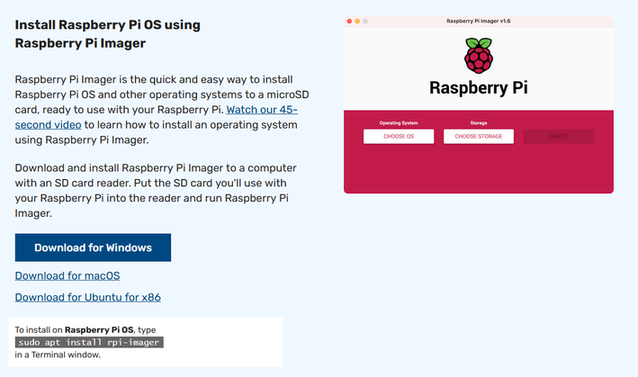
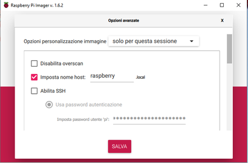
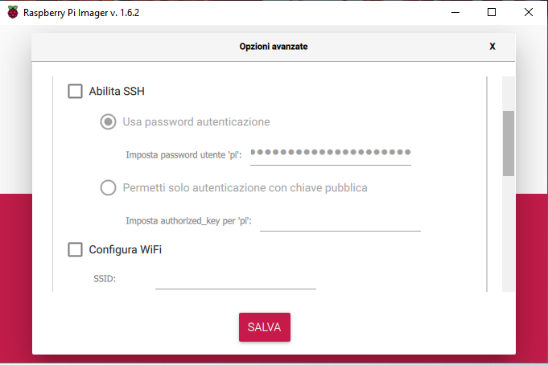
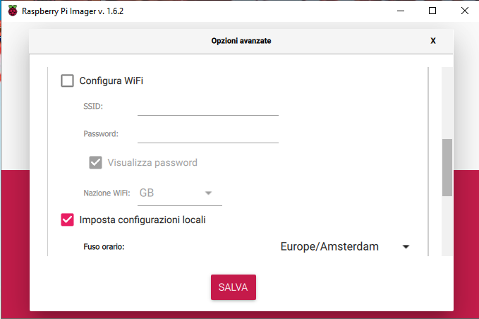
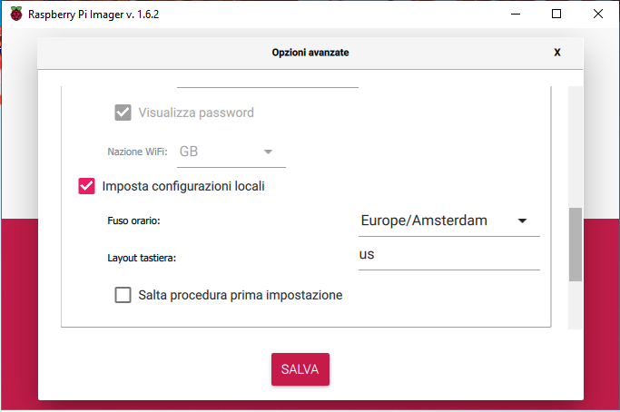
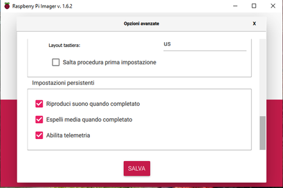

Installazione del sistema operativo e del software necessario e preparazione al primo utilizzo del Raspberry

# Installare e configurare Raspberry Pi OS
Scaricare e installare [Raspberry Pi Imager](https://www.raspberrypi.com/software/).



Aprire Raspberry Pi Imager e selezionare il sistema operativo. Nel mio caso, per esempio:
  * <kbd>CHOOSE OS</kbd>
  * <kbd>Raspberry Pi OS (other)</kbd>
  * <kbd>Raspberry Pi OS Lite (32-bit)</kbd>

Dopodichè, selezionare la scheda SD:
  * <kbd>CHOOSE STORAGE</kbd>
  * selezionare la scheda SD dall'elenco
    >**ATTENZIONE!!!** Questa operazione cancellerà tutti i dati sul dispositivo selezionato. Se si seleziona un dispositivo errato, il contenuto verrà cancellato.

Prima di passare alla scrittura, premere i tasti <kbd>Ctrl</kbd>+<kbd>Shift</kbd>+<kbd>x</kbd>. Con questa combinazione di tasti, si aprirá una finestra di configurazione iniziale del sistema.

Cambiare il nome host.



Abilitare l'accesso SSH con password o con una chiave pubblica.



Configurare la connessione WiFi inserendo tutti i dati necessari.



Impostare le configurazioni locali.



Le `Impostazioni persistenti` riguardano, Imager stesso non il sistema operativo.



> Le opzione avanzate sono **Opzionali** e possono essere modificate anche dopo l'installazione del sistema con il comando
> ```bash
> sudo raspi-config
> ```


il software necessario su Raspberry Pi

### Preparazione
```bash
cd
passwd
sudo apt install -y git curl
mkdir -p "$HOME/.local"
git clone https://github.com/ginocic/bash_aliases.git "$HOME/.local/BashAliases"
```

Test
```bash
. "$HOME/.local/BashAliases/bash_aliases"
```

Scrittura nel file ```.bashrc```
```bash
echo '. "$HOME/.local/BashAliases/bash_aliases"' >> ~/.bashrc
tail -5 ~/.bashrc
```

Testare in una sessione ssh duplicata e se tutto funziona correttamente
```bash
aggiorna && ripulisci
riavvia
```

### Note
Se si vuole disabilitare bluetooth e WiFi, aprire il il file `config.txt` con `nano`
```bash
sudo nano /boot/config.txt
```
Trovare la seguente linea
```
# Additional overlays and parameters are documented /boot/overlays/README
```
e aggiungere queste 2 linee sotto
```
dtoverlay=disable-wifi
dtoverlay=disable-bt
```
