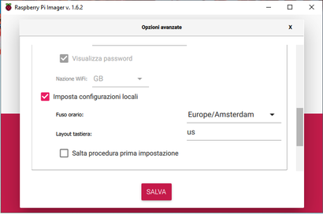

Installazione del sistema operativo e del software necessario e preparazione al primo utilizzo del Raspberry

# Installare e configurare Raspberry Pi OS
Scaricare e installare [Raspberry Pi Imager](https://www.raspberrypi.com/software/).


Aprire Raspberry Pi Imager e selezionare il sistema operativo. Nel mio caso, per esempio:
  * <kbd>CHOOSE OS</kbd>
  * <kbd>Raspberry Pi OS (other)</kbd>
  * <kbd>Raspberry Pi OS Lite (32-bit)</kbd>

Dopodichè, selezionare la scheda SD:
  * <kbd>CHOOSE STORAGE</kbd>
  * selezionare la scheda SD dall'elenco
    >**ATTENZIONE!!!** Questa operazione cancellerà tutti i dati sul dispositivo selezionato. Quindi, porre molta attenzione sulla scelta del dispositivo.

Prima di passare alla scrittura, premere i tasti <kbd>Ctrl</kbd>+<kbd>Shift</kbd>+<kbd>x</kbd>. Con questa combinazione di tasti, si aprirá una finestra di configurazione iniziale del sistema.

Cambiare il nome host.


Abilitare l'accesso SSH con password o con una chiave pubblica.


Configurare la connessione WiFi inserendo tutti i dati necessari.


Impostare le configurazioni locali.



Le `Impostazioni persistenti` riguardano, Imager stesso non il sistema operativo.


> Le opzione avanzate sono **Opzionali** e possono essere modificate anche dopo l'installazione del sistema con il comando
> ```bash
> sudo raspi-config
> ```

Infine, cliccare su <kbd>Write</kbd>. Attendere che Imager abbia terminato la scrittura e la verifica.

Inserire la scheda SD nel Raspberry e avviarlo.

# Accedere al Raspberry
Si può accedere al Raspberry in 2 modi
  1. Collegare monitor, tastiera e mouse (solo se si è stata installata la versione del OS con Desktop) al Raspberry.
  2. Conoscendo l'indirizzo IP del Raspberry, collegarsi aprendo una sessione ssh.
     > **Nota**: per procedere in questa modalità, bisogna aver inserito i parametri relativi all'accesso con SSH nelle `opzioni avanzate` di cui sopra

Per conoscere l'indirizzo IP del raspberry, utilizzare:
  1. software tipo [Advanced IP Scanner](http://www.advanced-ip-scanner.com/link.php?lng=it&ver=2-5-3850&beta=n&page=about).
     > Basta googlare `ip scanner`. Esistono centinaia di software del genere. Scegliere quello che più ci aggrada.
  2. Interrogando il proprio router (in genere, attraverso la relativa pagina web o software dedicato).

Una volta ottenuto l'indirizzo IP del Raspberry, aprire una sessione SSH e collegarsi al sistema. 

Anche qui, ci sono diversi software. Per esempio:
  1. [Putty](https://www.chiark.greenend.org.uk/~sgtatham/putty/)
  2. [MobaXterm](https://mobaxterm.mobatek.net/)
  3. PowerShell e Prompt dei Comandi di Windows

# Installazione del software necessario su Raspberry Pi
### Preparazione
```bash
cd
wget https://raw.githubusercontent.com/ginocic/bash_aliases/main/.bash_aliases
```

Testare in una sessione ssh duplicata e se tutto funziona correttamente
```bash
aggiorna && ripulisci
riavvia
```

### Note
Se si vuole disabilitare bluetooth e WiFi, aprire il il file `config.txt` con `nano`
```bash
sudo nano /boot/config.txt
```
Trovare la seguente linea
```
# Additional overlays and parameters are documented /boot/overlays/README
```
e aggiungere queste 2 linee sotto
```
dtoverlay=disable-wifi
dtoverlay=disable-bt
```
